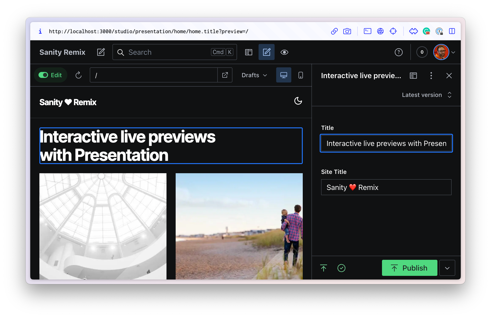

# Full-featured Sanity Studio + Remix Template

Batteries-included [Remix](https://remix.run/) website template with [Visual Editing](https://www.sanity.io/docs/visual-editing) for interactive live-preview inside [Presentation](https://www.sanity.io/docs/presentation) powered by an embedded [Sanity Studio](https://www.sanity.io/studio).



[Sanity Docs](https://sanity.io/docs) | [Remix Docs](https://remix.run/docs)

## Installation

From the command line, install this project as a Remix template:

```sh
npx create-remix@latest --template SimeonGriggs/sanity-remix-template
```

After setup, populate your `.env` file with the details of a new or existing Sanity project's ID and dataset name with the following command:

```sh
npx sanity@latest init --env
```

Then, start the development server:

```sh
npm run dev
```

Now open the Studio at [localhost:3000/studio](http://localhost:3000/studio) and start authoring content!

### Seed the Studio with fake content

Your new Sanity project starts with no content. A script is included in this repo [using Faker to generate content](https://www.sanity.io/guides/create-fake-demo-content-with-sanity-cli) to start with.

> [!WARNING]  
> This script will **delete** existing content in the dataset every time it is run. It is intended for use in a new dataset only.

```sh
npx sanity@latest exec ./scripts/createData.ts --with-user-token
```

## Includes

Useful Sanity examples with a light sprinkling of opinionated patterns

### Embedded Studio

Access to Sanity Studio v3 from within the Remix application itself. Now the whole Studio is a component, it lives at the `/studio` route.

### Visual Editing for interactive live preview inside Presentation

Powered by [Presentation](https://www.sanity.io/docs/presentation) and [@sanity/react-loader](https://www.sanity.io/docs/react-loader)

Authenticated users inside Sanity Studio can use the Presentation tool to browse through the website and target specific fields to edit - and see changes in real-time.

### Pre-configured Studio

The Studio has been pre-configured with a basic "Record Collection" schema, as well as a basic Desk Structure to include live preview within a view pane.

### Portable Text component

Powered by [@portabletext/react](https://github.com/portabletext/react-portabletext)

This component allows for the customization and extension of how Portable Text is rendered within your app. The Rich Text field in Sanity is an array of objects. Content as data!

### Image URL builder

Powered by [@sanity/image-url](https://github.com/sanity-io/image-url)

The `<RecordCover />` component has an example of how to generate a full Sanity CDN asset URL based on just the asset's ID. This is useful as we do not need to resolve the full image document in the query.

### Example decorated input

Powered by [@sanity/ui](https://www.sanity.io/ui)

Creating "decorated" inputs has never been easier than in Sanity Studio v3. `./app/sanity/components/Duration.tsx` is a 13-line example where a `number` field type to store duration as seconds can also be visualized in minutes. Minimal developer effort, maximum author impact.

### Sanity Client mutation

Powered by [@sanity/client](https://github.com/sanity-io/client)

Requires a token with **editor** permissions in `.env`. Clicking the like/dislike buttons on a Record's page will trigger a Remix action which will send a mutation to the document. This is an example of how user actions on the site may trigger changes on your Sanity dataset.

### Typed and validated responses

Powered by [Zod](https://zod.dev/)

The results of the Sanity query in `./app/routes/$slug.tsx` are parsed with a Zod validator. This ensures that content is always returned in the expected shape at **run time**, and auto-generates Types which are fed from the `loader` into `useLoaderData()`.

### Dynamic OG Image

The `record` type generates dynamic open graph images using the `~/routes/resource.og` resource route.

### Other development choices

- eslint and Prettier
- Tailwind CSS with presets by [@sanity/demo](https://github.com/sanity-io/demo)
- Tailwind Prose and Prettier plugins

## Sanity Studio

Visit `https://localhost:3000/studio` in your Remix app. You will need to:

1. Rename `.env.template` to `.env`
2. Set the correct Project ID, Dataset Name and preferred API Version from a project in your [Sanity Manage](https://sanity.io/manage)
3. Add `http://localhost:3000` to the CORS settings on that project, with Allow Credentials privileges

## Deployment

This Remix template is specifically configured for hosting on Vercel.

1. Check this repository into your own source control (like GitHub) and deploy to Vercel.
2. You will need to update `PRODUCTION_URL` in `./app/sanity/projectDetails.ts` to match your production URL. This value is used to enable "stega" encoding on all URLs other than in production. And when using the production URL to view the Studio will load the production build at one of the other automatically generated URLs.

### Using a Template

When you ran `npx create-remix@latest` there were a few choices for hosting. You can run that again to create a new project, then copy over your `app/` folder to the new project that's pre-configured for your target server.

```sh
cd ..
# create a new project, and pick a pre-configured host
npx create-remix@latest
cd my-new-remix-app
# remove the new project's app (not the old one!)
rm -rf app
# copy your app over
cp -R ../my-old-remix-app/app app
```
